# Creating a Firebase-Integrated React Web App 

>## 1. Setting up a Firebase Account, Application, and Database
### Create a Firebase Account and Application
1. Go to [https://firebase.google.com/](https://firebase.google.com/) and select "Sign in"

2. Sign in with an existing account or select "Create Account" and choose the account type needed. 
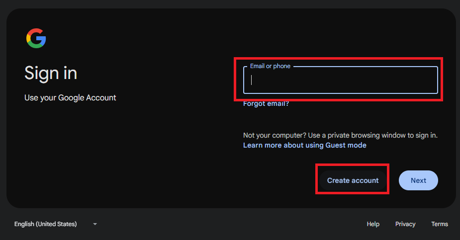
3. Select "Go to console", or "Create Project" if you are redirected to your console automatically. 

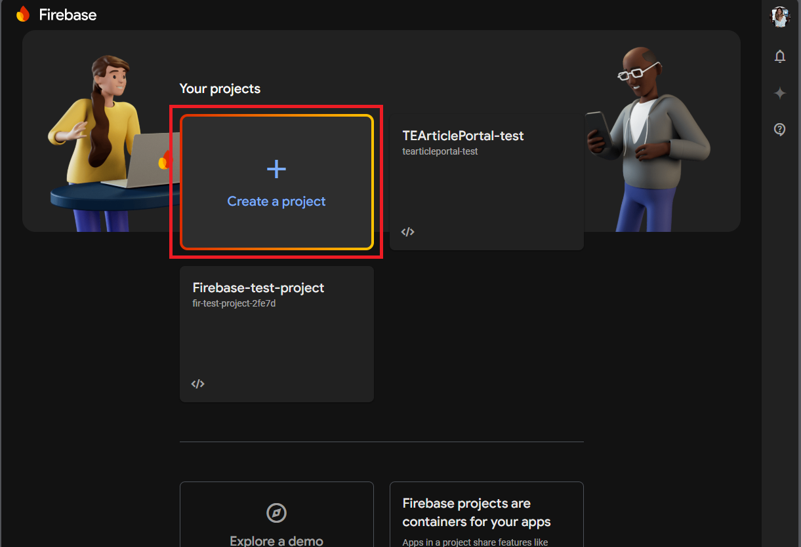
4. Enter your project name and click "Continue"
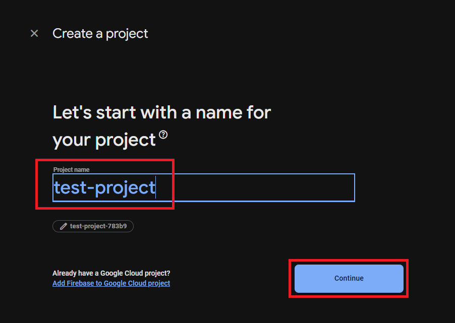
5. Enable Gemini in Firebase and click "Continue"
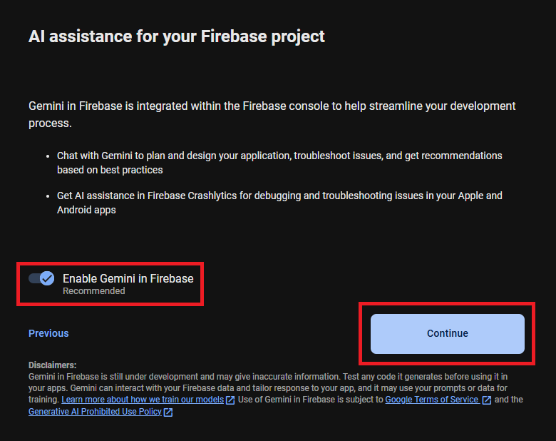
6. Enable Google Analytics and click "Continue"
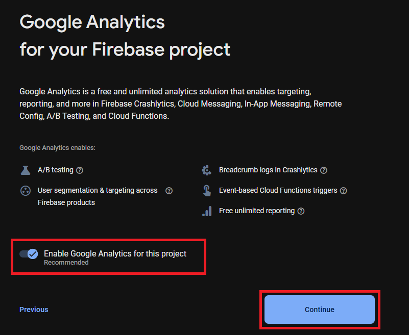
7. Select the "Default Account for Firebase" Gin the dropdown menu (unless otherwise specified) and click "Create Project"
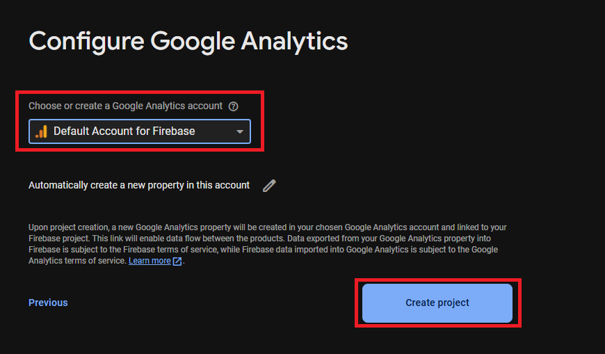
8. Click 'Continue" once your project is created.
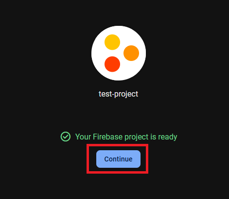
9. Click the web icon (</>) to set up Firebase for the web
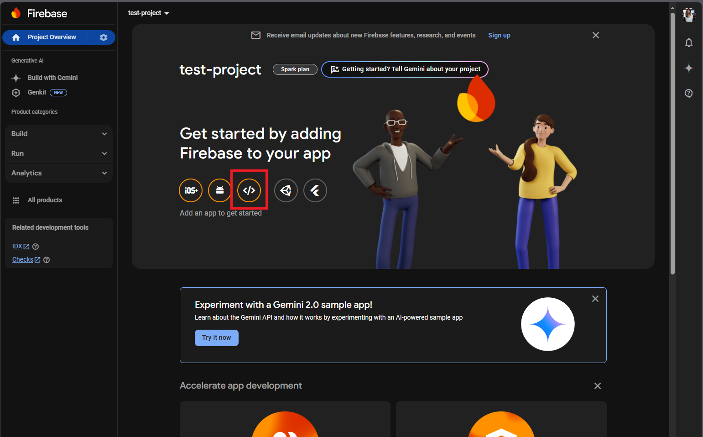
10. Enter a nickname for your app. Then click "Register app"
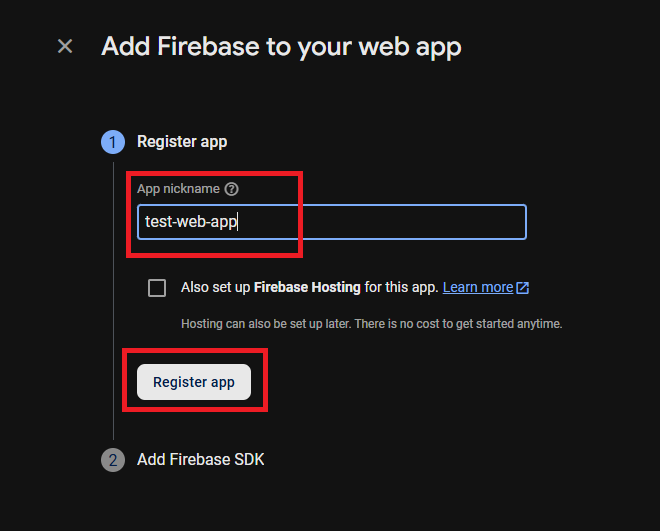
11. Copy the generated code (the Firebase SDK Configuration object) and paste it into a new file called "firebase.js" (this can be created in notepad++ or in VSCode). Then click "Continue to Console."
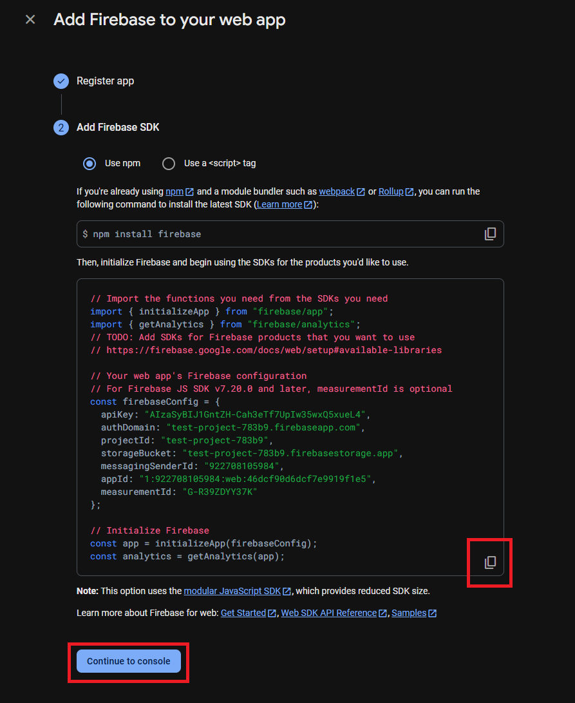
(Note: This code can be accessed again later through your projects dashboard)

### Set up a Firestore Database For Your Firebase Application
1. Under "Choose a product to add to your app" select "Cloud Firestore" 
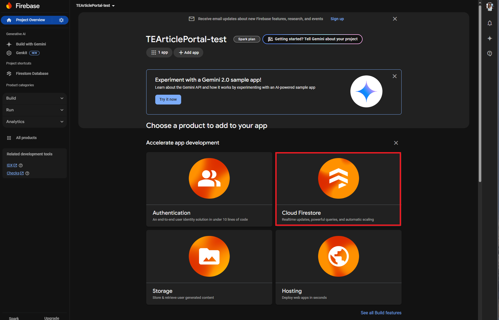
2. Select "Create Database" 
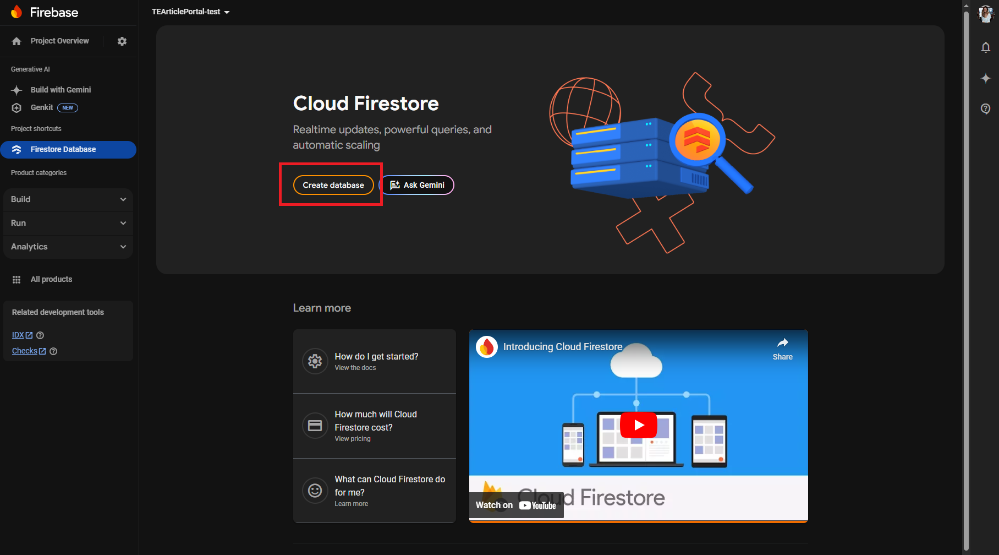
3. Choose your preferred Firestore location from the drop down, then click "Next"
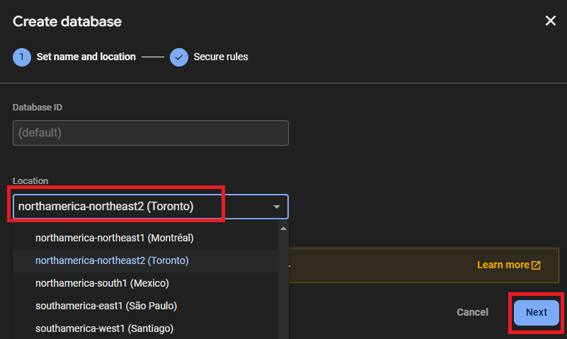
4. Select "Start in production mode" and then click "Create"
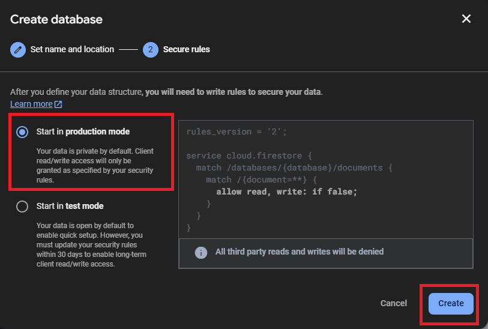

